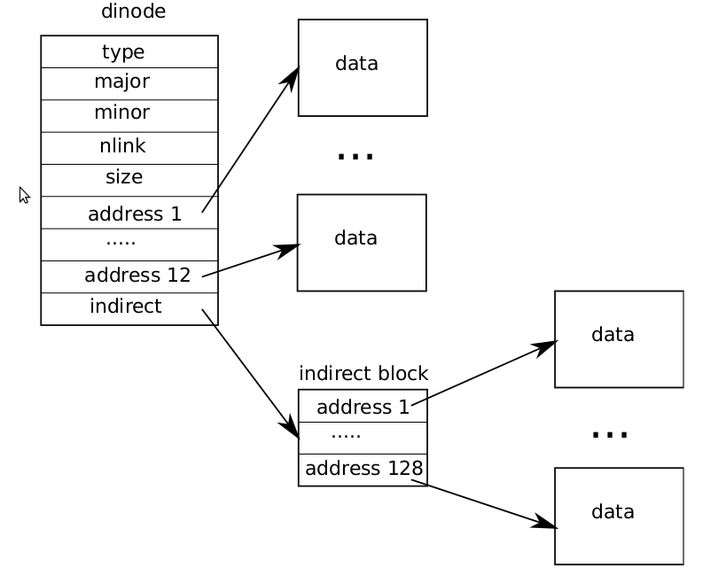

# Crusade Against (File System) Corruption

In this project you will be given one or more xv6 file systems which may or may not have been corrupted in different ways. Your job is to write an application which reads a file system file and parses the file system contained therein to locate every instance of corruption, describing each fully in print outs.

You are *not* responsible for repairing the corruption you find.

# Overall layout of the file system

The following image from [chapter 6 of the xv6 book](http://pekopeko11.sakura.ne.jp/unix_v6/xv6-book/en/File_system.html) shows the overall layout of our file system.


Every block is 512 bytes (```BSIZE```).

The Super Block is in block 1. It tells you how many inodes are in the file system. From this you can compute the number of blocks devoted to the inode array beginning at block 2.

After the inode array, the bit map blocks are found. In the file systems you will be given, there exists only **one** block in this part of the file system. The bit map contains a bit for every block. If a block is available, its bit will be zero.

After the bit map block comes the data blocks.

You will ignore the log blocks at the end of the file system (if present).

# fs.h

Nearly everything you need to known about the file system is contained here:

[fs.h](./fs.h)

There are a number of handy C macros in this file. For example, ```IPB``` will compute the number of blocks that some specified number of inodes will consume.

## The super block and the first thing you should do

The super block contains only three values.

The first thing you should write is code to check the size of the file system file against the ```size``` in the super block. Ensure you can make sense of the ```size``` field before you move on. The file systems you will be given should contain 1024 blocks.

*You must print out the three values in the super block in your output.*

## Inodes

The file sysem's inodes are simplified from those we learned about.

For you, this is a *Good Thing*.



Notice there is only a single layer of indirection possible.

Ignore ```major``` and ```minor```.


## No free block list

This file system does away with the free block list. 

For you, this is a *Good Thing*.

Instead it keeps track of free blocks using a bit map. One bit corresponds to one block. A 512 byte block contains 4096 bits. Therefore a single block is needed for the file systems you will be given (as they contain fewer that 4096 blocks).

# types.h

Self explanatory.

# stat.h

From here you get the definition of ```T_DIR``` and ```T_FILE```.

# Build an in-memory model of the file system

You must build an in-memory model of the file system so that you can account for every file, block, inode, directory etc. This does *not* mean you simply read the whole file system file into memory.

# Types of errors

The following types of corruption will be present in one or more of the file system files you are given.

## Missing block

The bit map says block *n* is allocated but you cannot find it belonging to  any file or directory.

## Unallocated block

The bit map says block *n* is free but you found it referenced by a valid inode.

## Multiply allocated block

An allocated block is referenced by more than one inode, or more than once by the same inode.

## Missing inode

An inode number is found in a valid directory but is not marked as allocated in the inode array.

## Unused inode

An inode marked valid is not referred to by a directory.

## / problems

These problems relate to /.

- Inode 1 is not allocated.

- Inode 1 is not a directory.

- The root directory does not refer to itself as . and ..

## . and ..

A directory's first two file names are not . and ..

## Directory loops

A directory may not refer to another directory which is an ancestor of itself other than its parent (i.e. ..).

## A . or .. inode is not a directory

The inode numbers mapping a . or .. lead to non-directories. 

## A non-root directory with . listing inode 1

Inode 1 is the root directory. No other directory can list itself (i.e. .) as inode 1.

## Directory link counts

The link count in a directory inode is not the number of directories it contains. Note this is really covered by the next error.

## File link count

The link count of a file is not the number of times the file is referred to by a directory.

## File size

A file's size in bytes cannot exceed the maximum file size (figure out what this is).

## A valid directory entry non-printable ASCII

File names with non printable ASCII characters should be flagged.

# Platform and language

All work must be in C and / or C++ designed for Linux and compilable by ```g++ -std=c++11```.

# Usage

Your program should check the validity of ```argv[1]```. It is an error should the argument not be given or is bogus.

# All error messages 

Should be as specifc as possible listing block or inode numbers.

# Partner rules

All work is solo. No partners.


