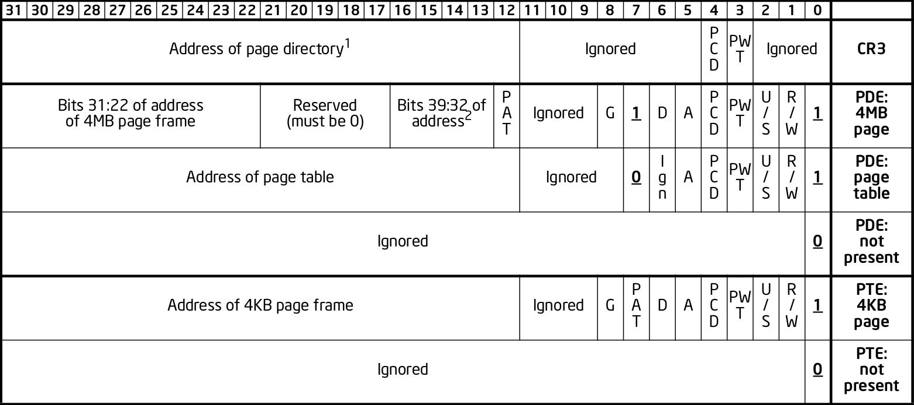

# CSC 4730 - Project 6

In this project you will take xv6 where you left off (you moved the stack) and add a system call that returns a physical address given a virtual address. Of course, some virtual address are invalid. If you are given an invalid virtual address, you must return 0.

You are given a test program which makes a number of calls to your new functionality.

## The system call

You must implement:

```c
int vmtranslate(void *)
```

The argument is a virtual address.

The return value is a physical address (as an integer).

## Test program

This must be called `vmtranslate.c`

```c
#include "types.h"
#include "user.h"

int main(int argc, char ** argv) {
	unsigned int mask = 0x3FF;
	unsigned int nbytes = 0x1000;
	unsigned char s1[nbytes];
	unsigned char s2[nbytes];
	unsigned char s3[nbytes];
	unsigned char * h1 = malloc(nbytes);
	unsigned char * h2 = malloc(9);
	unsigned char * h3 = malloc(9);

	// h1 - being the first malloc would have mask(0x3FF) == 0 - 0 isn't pretty formatting. 
	h1 = malloc(32);

	printf(1, "vmtranslate(0x%x)     offset(0x%x)   0x%x\n", 0, 0, (unsigned int) vmtranslate(0));
	printf(1, "vmtranslate(0x%x)  offset(0x%x)   0x%x\n", 
		(void *) main, ((unsigned int) main & mask), (unsigned int) vmtranslate((void *) main));
	printf(1, "vmtranslate(0x%x) offset(0x%x) 0x%x\n", 
		(void *) s1, ((unsigned int) s1 & mask), (unsigned int) vmtranslate((void *) s1));
	printf(1, "vmtranslate(0x%x) offset(0x%x) 0x%x\n", 
		(void *) s2, ((unsigned int) s2 & mask), (unsigned int) vmtranslate((void *) s2));
	printf(1, "vmtranslate(0x%x) offset(0x%x) 0x%x\n", 
		(void *) s3, ((unsigned int) s3 & mask), (unsigned int) vmtranslate((void *) s3));
	printf(1, "vmtranslate(0x%x)  offset(0x%x) 0x%x\n", 
		(void *) h1, ((unsigned int) h1 & mask), (unsigned int) vmtranslate((void *) h1));
	printf(1, "vmtranslate(0x%x)  offset(0x%x) 0x%x\n", 
		(void *) h2, ((unsigned int) h2 & mask), (unsigned int) vmtranslate((void *) h2));
	printf(1, "vmtranslate(0x%x)  offset(0x%x) 0x%x\n", 
		(void *) h3, ((unsigned int) h3 & mask), (unsigned int) vmtranslate((void *) h3));
	printf(1, "vmtranslate(0x%x) offset(0x%x) 0x%x\n", 
		(void *) s3 - nbytes * 3, ((unsigned int) (s3 - nbytes * 3) & mask), 
		(unsigned int) vmtranslate((void *) h3 + nbytes * 3));
	printf(1, "vmtranslate(0x%x)  offset(0x%x) 0x%x\n", 
		(void *) h3 + nbytes * 3, ((unsigned int) (h3 + nbytes * 3) & mask), 
		(unsigned int) vmtranslate((void *) h3 + nbytes * 3));
	exit();
}
```

The first line of output and the last two must show a return value of 0.

## Important information



## Unreasonable hint

Implement your system call in `vm.c` next to `walkpgdir()`. The picture above plus the hint just given is everything you need to implement the system call.

To scale your expectations, my implementation is 15 non-comment non-blank lines.

## Sample output

```text
$ vmtranslate
vmtranslate(0x0)     offset(0x0)   0x0
vmtranslate(0x1000)  offset(0x0)   0xDEE5000
vmtranslate(0x9EFB0) offset(0x3B0) 0xDFBC3B0
vmtranslate(0x9DFB0) offset(0x3B0) 0xDF773B0
vmtranslate(0x9CFB0) offset(0x3B0) 0xDFBF3B0
vmtranslate(0x8FA8)  offset(0x3A8) 0xDFC63A8
vmtranslate(0x8FE8)  offset(0x3E8) 0xDFC63E8
vmtranslate(0x8FD0)  offset(0x3D0) 0xDFC63D0
vmtranslate(0x99FB0) offset(0x3B0) 0x0
vmtranslate(0xBFD0)  offset(0x3D0) 0x0
$
```

## What to hand in

**MAKE CLEAN** before you zip.

Zip up your whole xv6 folder and submit to schoology.

## Partner rules

SOLO WORK.
